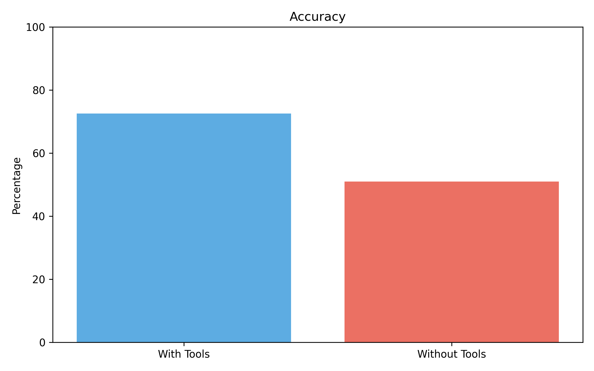
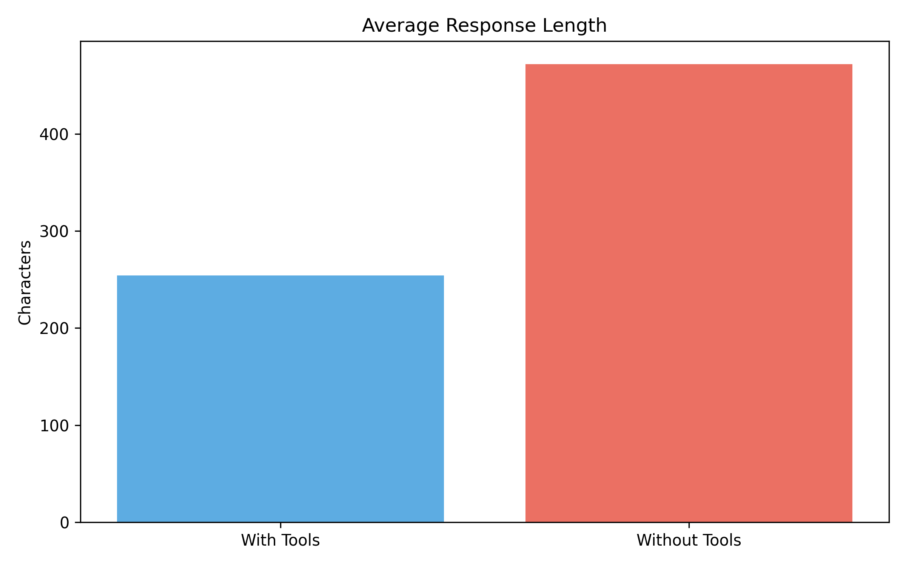
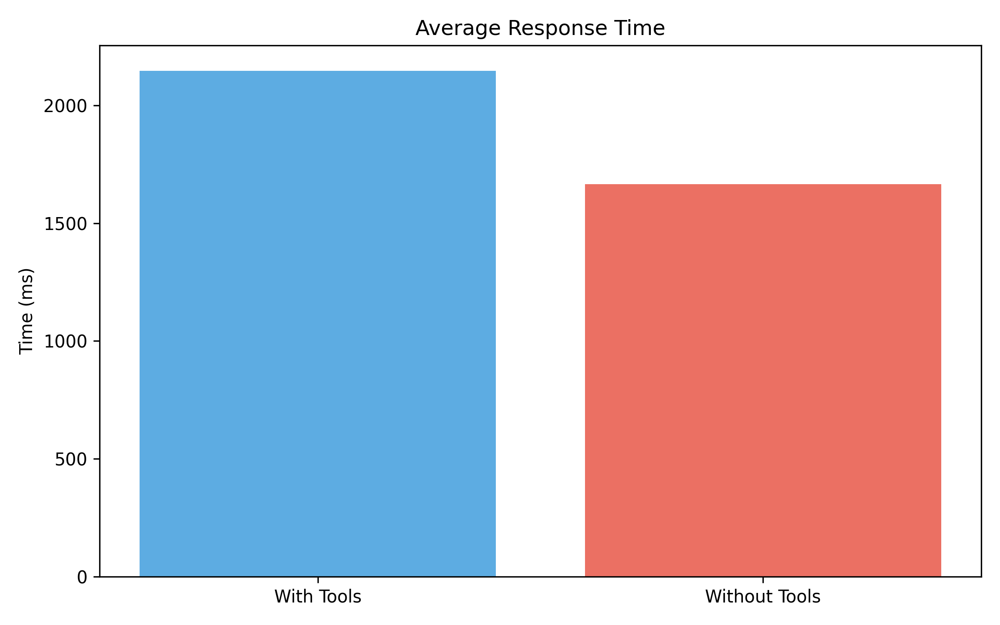
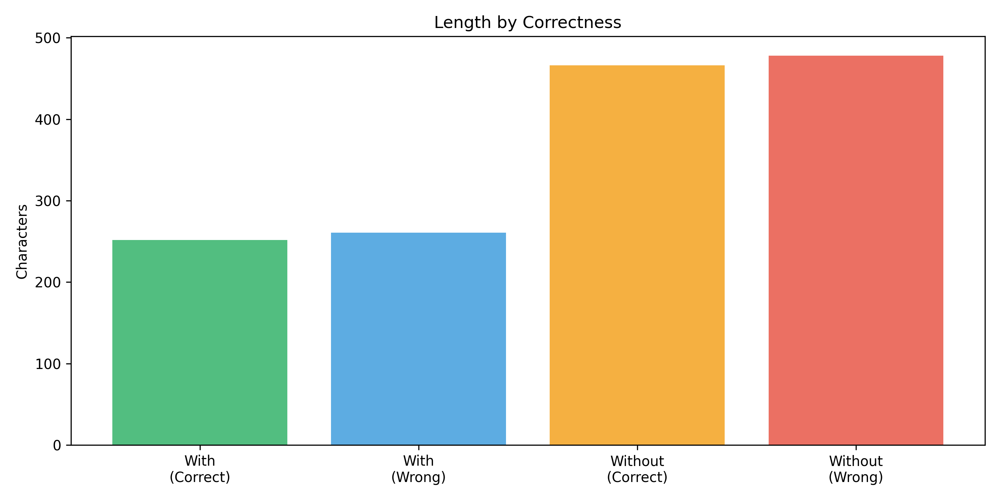

# Count von Count 🧛‍♂️

This projects adds custom tools in Rust (calculator and datetime) to OpenAI's API. The goal of this project was to learn how AI Agents can interact with tools and see how these tools can make systems more reliable.

### Results

gpt-4.1-nano showed an increase in accuracy (72% vs 51%) and a reduction in output length (254 chars vs 472, almost half), but an increase in time (29% slower).

Without tools, the model tends to provide detailed step-by-step reasoning with LaTeX formatting and explicit final answer formatting. With tools available, the model becomes more direct but sometimes calls tools unnecessarily (like datetime for math problems) or struggles with complex expressions the calculator can't parse.

An interesting example of this was the question "How many minutes to bake 12 potatoes if 4 take 47 minutes?" With tools the model answered as pure math (141), but without tools, the model said 47 minutes and argued that it would be the same regardless of the amount of potatoes, interpreting it more as a riddle.

Additionally, tools failed 3 times to error and some questions were ambigious, leading to "technically correct" solutions, so take these results with a grain of salt.






### Installation

```bash
# Clone the repository
git clone https://github.com/phunt22/countvoncount.git
cd countvoncount

# Set up .env file

### Example .env file
#### (note: if MODEL_NAME is ommitted, then gpt-4.1-nano will be used)
    OPENAI_API_KEY=sk-<YOUR-KEY-HERE>
    MODEL_NAME=gpt-4.1-nano

# Build and install
cargo build --release
cargo install --path .
```

### Usage

```bash
# Ask questions with tools (default)
cvc "How many days until Thanksgiving?"

# Ask without tools (for comparison)
cvc --no-tools "How many days until Thanksgiving?"

# Run benchmarks
cvc --combine

# Enable verbose output (to track tool calling behavior)
cvc --verbose "Complex calculation: (25 + 75) * 2 / 4"
```

## Benchmarking

`test_cases.yaml` contains 100 test cases.
Some of these expected answers in the yaml file will not be accurate, since they are time dependent. These are shown in the form `expected_answer (<actual answer at time of writing>)`

To run the benchmark, simply run:

```bash
cvc --combine
```

Results will be saved to a `.jsonl` file in the `results` directory, with the prompt, expected output, and results with and without tools.

For scoring the LLM's result in the previous step, I did human-as-a-judge, which is like LLM-as-a-judge, except it is done by a human (me). My rule of thumb was +/- 1 was a success.

### Analysis & Visualization

```bash
# Score results (manually)
cd analysis
python score.py ../results/<BENCHMARK_NAME>.jsonl

# Generate charts
./run.sh ../results/<BENCHMARK_NAME>.jsonl
```

This creates some charts that will compare the results, looking at things like length, time, and accuracy.

### Custom Test Cases

```yaml
schema: [prompt, expected_output]
tests:
  - ["How many days unitl thanksgiving?", "88"]
  - ["What time is it?", "current_time"]
```

## Adding New Tools

Ability to add new tools was a consideration in development, and should (hopefully) be pretty easy to do. Simply:

1. Create a new file in `src/tools/<your_tool>.rs`
2. Implement the `Tool` trait
3. Register it in `src/tools/mod.rs`
4. Edit the system prompt to tell the model it has that tool in `src/cli.rs`
5. Add tests

Example:

```rust
use async_trait::async_trait;
use crate::tools::Tool;

pub struct <YourTool>;

#[async_trait]
impl Tool for <YourTool> {
    fn name(&self) -> &'static str { "your_tool" }
    fn description(&self) -> &'static str { "Description" }
    fn json_schema(&self) -> serde_json::Value { /* schema */ }
    async fn run(&self, args: HashMap<String, Value>) -> Result<String, AgentError> {
        // YOUR IMPLEMENTATION HERE
    }
}
```

## Acknowledgments

- `OpenAI` for the API
- `evalexpr` crate for expression evalutaion
- `chrono` for datetime handling
- `clap` for CLI argument parsing
